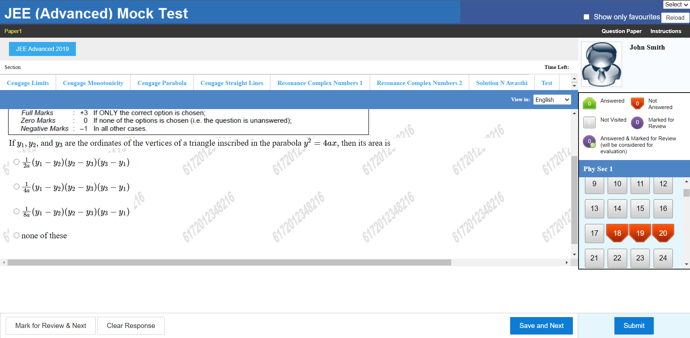
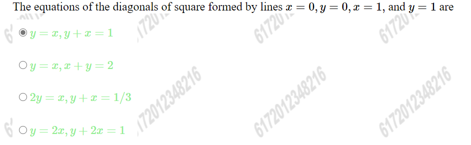
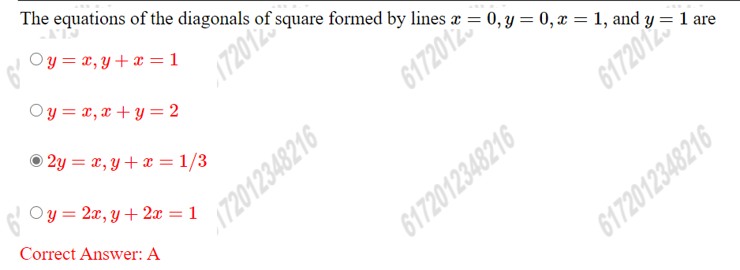

# JEE-Simulation-Website
A mock-JEE website to give tests scanned from the Questions OCR App to get students fully familiar with the JEE interface

You can visit the website here: https://atharvat.github.io/JEE-Simulation-Website/

Different question sets are avaiable under the sections heading. You can navigate to different questions using the bottom panel or using the questions palette on the right.
After you have solved the questiona click on the submit buttom to get the results.

If the answer is correct you will get a the following response:

If the answer is incorrect you will get a the following response:

